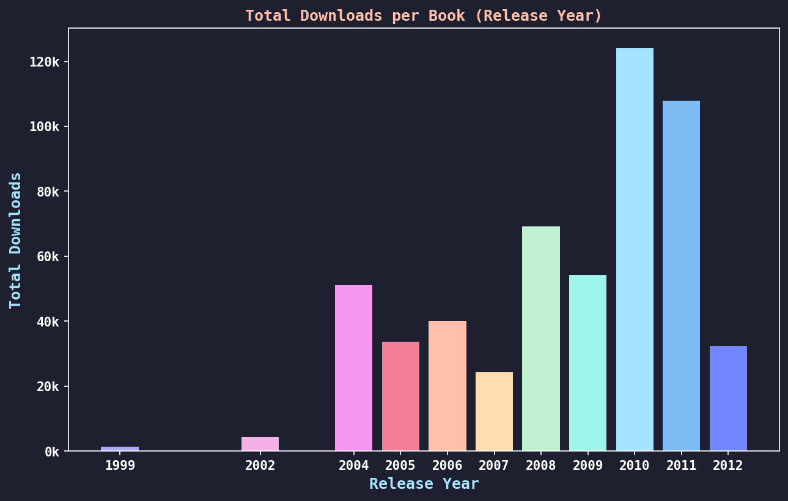
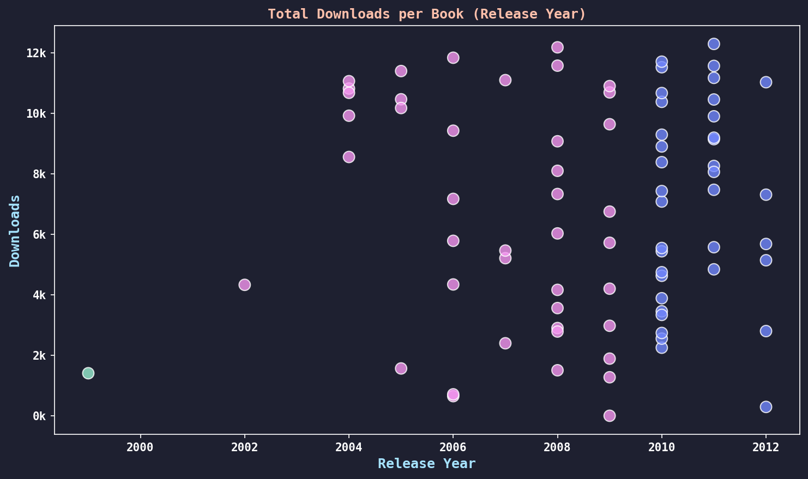

### eBook Data Analysis
String parsing and data manipulation in Python using a Project Gutenberg eBook dataset. Covers string slicing/splitting, custom sorting functions, dictionary aggregation, and list manipulation.

**Final grade:** 100%

  
  

