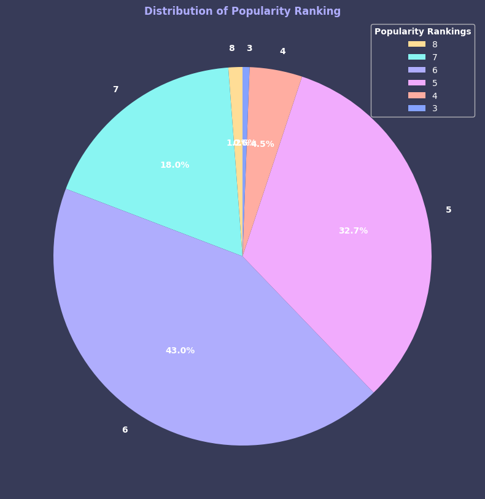

### Movie Dataset Analysis II
Structured data analysis and visualization using a movies dataset. Covers handling missing values, boolean filtering, label-based and positional slicing, value counts, and pie chart visualization with matplotlib. 

|     | id     | title                     | original\_language | revenue   | budget    | runtime | status   | tagline | vote\_count | year | popularity\_ranking |
|:----|:-------|:--------------------------|:-------------------|:----------|:----------|:--------|:---------|:--------|:------------|:-----|:--------------------|
| 56  | 188927 | Star Trek Beyond          | en                 | 343471816 | 185000000 | 122.0   | Released | NaN     | 2568        | 2016 | 6                   |
| 602 | 10550  | Ballistic: Ecks vs. Sever | en                 | 19924033  | 70000000  | 91.0    | Released | NaN     | 97          | 2002 | 4                   |
| 835 | 58224  | Mr. Popper's Penguins     | en                 | 187361754 | 55000000  | 94.0    | Released | NaN     | 751         | 2011 | 5                   |
| 540 | 11375  | Hollywood Homicide        | en                 | 51142659  | 75000000  | 116.0   | Released | NaN     | 166         | 2003 | 5                   |
| 128 | 13448  | Angels & Demons           | en                 | 356613439 | 150000000 | 138.0   | Released | NaN     | 2129        | 2009 | 6                   |

##

  

