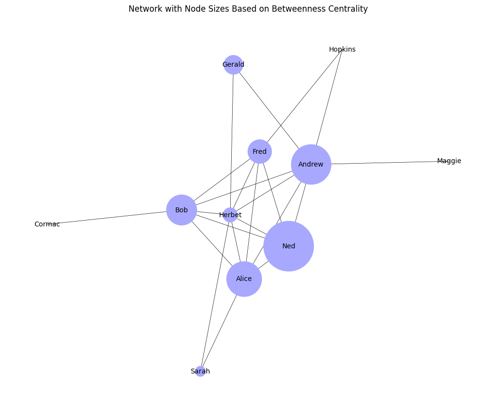
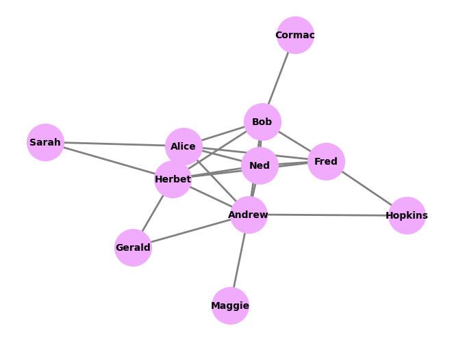

### Description
Explores the fundamentals of network analysis using NetworkX and pandas.

Tasks include identifying nodes, edges, paths, and cycles in a weighted undirected graph, loading network data with NetworkX, finding neighbours, computing weighted degree centrality, comparing nodes by communication cost, calculating betweenness centrality to find the most-connected bridge node, and drawing a network visualization with node sizes scaled to centrality values.

| node    | betweeness |
|:--------|:-----------|
| Andrew  | 0.333333   |
| Bob     | 0.208889   |
| Herbet  | 0.175556   |
| Alice   | 0.086667   |
| Fred    | 0.066667   |
| Hopkins | 0.008889   |
| Ned     | 0.008889   |
| Maggie  | 0.000000   |
| Gerald  | 0.000000   |
| Sarah   | 0.000000   |

| node    | wdegree |
|:--------|:--------|
| Herbet  | 244     |
| Alice   | 164     |
| Andrew  | 144     |
| Bob     | 107     |
| Fred    | 91      |
| Maggie  | 51      |
| Ned     | 33      |
| Hopkins | 27      |
| Sarah   | 9       |
| Gerald  | 7       |
